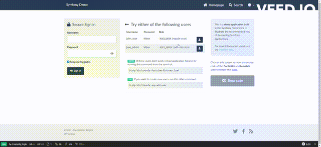

# Deploy the application

### Building Docker image

First of all, we need to create our docker image, and in order to be able to push the image into our repository, our image tag must have the format `REGION-docker.pkg.dev/PROJECT-ID/REPOSITORY/IMAGE`:

```shell,exclude
# we export the image name to an enviornment variable
export IMAGE_NAME=$REGION-docker.pkg.dev/$PROJECT_ID/symfony-demo/symfony-demo:v1

# Then we build the docker image using that enviornment variable
docker build -t $IMAGE_NAME:v1 .
```

Then we push the image to our repository:

```shell
docker push $IMAGE_NAME:v1
```
---

### Deploying the application to the cluster

First, we need to connect to our cluster:

```shell
gcloud container clusters get-credentials --zone=$ZONE symfony-demo-cluster
```
Then we navigate to the `gcp/gke/manifests` directory (where we find our manifests templates)

```shell
cd gcp/gke/manifests
```

In order to use kubectl and deploy our application, we must create our .yaml files from the templates by replacing the variables `$IMAGE_NAME` and `$DISK_NAME` respectively by the name of our image and the id of the disk that we created at the end of the step [Provision the infrastructure using Terraform](docs/terrafrom-provisioning.md)

```shell
envsubst < app-manifest.yaml.template > app-manifest.yaml
envsubst < database-manifest.yaml.template > database-manifest.yaml
```
*NB: If you use the envsubst command to create your .yaml files, make sur that your environment variables must have exactly the names `$IMAGE_NAME` and `$DISK_NAME`*


Then we can deploy our application as well as our database:

```shell
kubectl apply -f app-manifest.yaml
kubectl apply -f database-manifest.yaml
```

Next we create our database and load the fixtures:

```shell
kubectl exec -it deployments/app-deployment -- php bin/console doctrine:database:create
kubectl exec -it deployments/app-deployment -- php bin./console doctrine:fixtures:load
```

In order to get the public IP address to access the application, run this command and wait for the address to appear for the `EXTERNAL-IP` column

```shell
kubectl get service symfony-demo-service --watch
```

Finally we access this address from our browser and we will have our application that works

<p align="center">
  
</p>

---
Next step: 