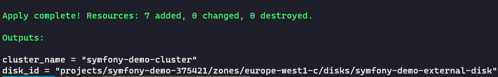

# Provision the infrastructure using Terraform

Before starting, we must declare the different environment variables that we will use in our commands later:


```shell
export REGION=europe-west1
export ZONE=europe-west1-c
export PROJECT_ID=YourProjectID
export BUCKET_NAME=YourUniqueBucketName
gcloud config set project $PROJECT_ID
```

---
### Terraform configuration

The first step to do is to create our service account that will be used by Terraform:

```shell
gcloud iam service-accounts create terraform-service-account \
--description="Service account used by terraform" \
--display-name="terraform-service-account"
```
Next, we need to create and export the service account authentication key for later use by Terraform:

```shell
gcloud iam service-accounts keys create \
terraform-service-account-key.json \
--iam-account=terraform-service-account@$PROJECT_ID.iam.gserviceaccount.com
```
This command allows us to have the `terraform-service-account-key.json` file which will contain the key of the service account.


In order for Terraform to use this key, it must be declared as an environment variable as follows:

```shell,exclude
# This variables is used to authenticate to our project for each Terraform run
 export TF_VAR_GOOGLE_CREDENTIALS=$(cat terraform-service-account-key.json)

# this variable is used to authenticate to the remote state backend
# when we first setup our GCP configuration
export GOOGLE_CREDENTIALS=$(cat terraform-service-account-key.json)
```

After that, we create and assign the service account a custom role that respects the security principle of least privilege and that will contain exactly the permissions we need:

```shell
gcloud iam roles create --project=$PROJECT_ID --file=gcp/gke/terraform/terraform-role.yaml

gcloud projects add-iam-policy-binding $PROJECT_ID \
--member="serviceAccount:terraform-service-account@$PROJECT_ID.iam.gserviceaccount.com" \ 
--role=projects/$PROJECT_ID/roles/terraform_role
```
The `gcp/gke/terraform/terraform-role.yaml` file contains the list of all necessary permissions for the service account.

finally we create the bucket that will contain our terraform state

```shell
gsutil mb gs://$BUCKET_NAME
```
*NB: the bucket name must be unique, just like the project id*

---
### Understanding the infrastructure

Terraform scripts are located in the `gcp/gke/terraform` folder:

```shell
cd gcp/gke/terraform
```
For this example we will create the following components:

- Artifact registry repository used to manage Docker images
- GKE cluster
- GKE nodepool
- Service account with the artifactregistry.reader role used by the cluster
- VPC network & subnetwork with which the cluster is linked
- Compute disk used to hold the persistent volume that will contains the database data

In this example we have created 2 modules:
One for cluster management and the other for network management

The structure of the terraform project is illustrated by the following tree structure:

```
📦terraform
 ┣ 📂modules
 ┃ ┣ 📂gke
 ┃ ┃ ┣ 📜main.tf
 ┃ ┃ ┣ 📜outputs.tf
 ┃ ┃ ┗ 📜variables.tf
 ┃ ┗ 📂network
 ┃ ┃ ┣ 📜main.tf
 ┃ ┃ ┣ 📜outputs.tf
 ┃ ┃ ┗ 📜variables.tf
 ┣ 📜backend.conf
 ┣ 📜main.tf
 ┣ 📜outputs.tf
 ┗ 📜variables.tf
```
---
### Provision the infrastructure
Still under the gcp/gke/terraform folder, we replace the name of the bucket in the `backend.conf` file with the name of the bucket we created

After that, we initialize our Terraform project by passing the backend.conf file as a parameter:

```shell
terraform init --backend-config=backend.conf
```

This will allow us to use the google provider and set up the remote backend

Then, we launch terraform plan to visualize the resources we will create:

```shell
terraform plan \
  -var "region=${REGION}" \
  -var "zone=${ZONE}" \
  -var "project_id=${PROJECT_ID}" \
```

To confirm the execution and the creation of the different resources, we run:

```shell
terraform apply -auto-approve \
  -var "region=${REGION}" \
  -var "zone=${ZONE}" \
  -var "project_id=${PROJECT_ID}" \
```
This process may take about fifteen minutes to complete.

When done, we should have the following result:



Here we can see that the execution was successful and that we get as result the name of the cluster created as well as the id of the compute disk that will be needed for the next step:

```shell
export DISK_NAME=YourDiskId
```
*where YourDiskId is the value of the output `disk_id`*

---
Next step: [Deploy the application](gke-deploy.md) 